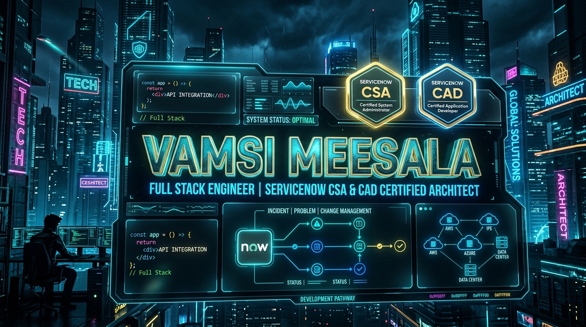
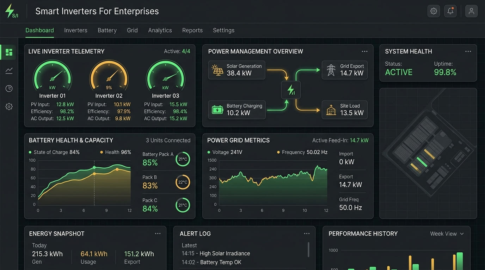

<div align="center">

  <!-- 🌟 SUPREME AAA CYBER HUD BANNER 🌟 -->
  

  <br/><br/>

  <!-- ⚡ ANIMATED GLOWING TYPING HEADER ⚡ -->
  <a href="https://github.com/meesalavamsi">
    
  </a>

  <br /><br />

  <!-- 🛡️ GLOWING BADGES MATRIX 🛡️ -->
  <p align="center">
    <a href="https://komarev.com/ghpvc/?username=meesalavamsi&label=PROFILE%20VIEWS&color=00f0ff&style=for-the-badge"></a>
    &nbsp;&nbsp;
    <a href="https://github.com/meesalavamsi"></a>
    &nbsp;&nbsp;
    <a href="https://github.com/meesalavamsi"></a>
    &nbsp;&nbsp;
    <a href="https://github.com/meesalavamsi"></a>
  </p>

  <br/>

  <p align="center">
    <code>🟢 <b>SYSTEM STATUS:</b> Architecting High-Reliability Enterprise Workflows & Live IoT Power Systems</code>
  </p>

</div>

<br/><br/>

---

<br/>

### ⚡ System Console // Developer Matrix

```zsh
vamsi@enterprise-host:~$ whoami --verbose

┌───────────────────────────────────────────────────────────────────────────────────────────────────────┐
│  IDENTITY     : Vamsi Meesala 👋                                                                      │
│  ROLE         : Full Stack Developer & ServiceNow Enterprise Architect                                │
│  CERTIFICATIONS: ServiceNow CSA (System Admin) | ServiceNow CAD (Application Dev)                     │
│  SPECIALIZATIONS: Enterprise Workflow Automation · Healthcare Portals · IoT Power Analytics           │
│  CORE STACK   : React · Node.js · TypeScript · ServiceNow Table API · Flow Designer · AWS · Docker  │
│  STATUS       : 🟢 Available for Global Remote Roles & High-Impact Enterprise Architecture            │
└───────────────────────────────────────────────────────────────────────────────────────────────────────┘

vamsi@enterprise-host:~$ cat philosophy.json
{
  "mission": "Transforming complex enterprise chaos into sub-100ms automated systems.",
  "architecture_pillars": ["Zero SLA Breach", "Sub-100ms UX", "Clean Scalable Code", "End-to-End Security"],
  "currently_building": "Live Smart Inverter IoT Telemetry Engine & AI-Assisted ServiceNow Workflows."
}
```

<br/><br/>

---

<br/>

### 🏆 ServiceNow Credentials & Specialization Hub

<br/>

<table width="100%" cellpadding="16">
  <tr>
    <td width="50%" align="center" valign="top">
      <br/>
      
      <br/><br/>
      <h3>Certified System Administrator (CSA)</h3>
      <br/>
      <p style="line-height: 1.6;">
        Expertise in Instance Configuration, Security Rules (ACLs), CMDB Health, Flow Designer Automations, User/Group Security Administration, and Core ITSM Suite Management.
      </p>
      <br/>
    </td>
    <td width="50%" align="center" valign="top">
      <br/>
      
      <br/><br/>
      <h3>Certified Application Developer (CAD)</h3>
      <br/>
      <p style="line-height: 1.6;">
        Mastery of Custom Scoped Applications, Server-Side Script Includes, Business Rules, REST/SOAP Table API Integrations, Service Portal Custom Widgets & Client Scripts.
      </p>
      <br/>
    </td>
  </tr>
</table>

<br/><br/>

---

<br/>

### 🛠️ Tech Stack & Enterprise Arsenal

<br/>

<div align="center">

  <h4 style="color:#00f0ff;">🎨 Frontend Engineering</h4>
  <br/>
  <p align="center">
    &nbsp;&nbsp;
    &nbsp;&nbsp;
    &nbsp;&nbsp;
    &nbsp;&nbsp;
    &nbsp;&nbsp;
    
  </p>

  <br/>

  <h4 style="color:#00f0ff;">⚙️ Backend & API Architecture</h4>
  <br/>
  <p align="center">
    &nbsp;&nbsp;
    &nbsp;&nbsp;
    &nbsp;&nbsp;
    
  </p>

  <br/>

  <h4 style="color:#00f0ff;">🚀 ServiceNow Enterprise Platform</h4>
  <br/>
  <p align="center">
    &nbsp;&nbsp;
    &nbsp;&nbsp;
    &nbsp;&nbsp;
    &nbsp;&nbsp;
    
  </p>

  <br/>

  <h4 style="color:#00f0ff;">☁️ Cloud, DevOps & Tools</h4>
  <br/>
  <p align="center">
    &nbsp;&nbsp;
    &nbsp;&nbsp;
    &nbsp;&nbsp;
    &nbsp;&nbsp;
    &nbsp;&nbsp;
    
  </p>

  <br/><br/><br/>

  

</div>

<br/><br/>

---

<br/>

### 🚀 Featured Code Repositories & Live Solutions

<br/>

<table width="100%" cellpadding="18">
  <tr>
    <td width="100%" valign="top">
      
      <br/>
      <h3>⚡ Smart Inverters For Enterprises — Live Running IoT Platform &nbsp; </h3>
      <br/>
      <p style="line-height: 1.6;">
        <b>Enterprise Power & Energy Management Platform</b> monitoring smart inverter efficiency, battery health, solar generation feeds, and sub-second fault alert diagnostics in real time across enterprise infrastructure.
      </p>
      <br/>
      <ul>
        <li><b>Key Feature:</b> Real-time IoT telemetry data aggregation, load balance visualization, and automated alert dispatching.</li>
        <br/>
        <li><b>Tech Stack:</b> <code>TypeScript</code> · <code>Node.js</code> · <code>REST API</code> · <code>IoT Telemetry</code> · <code>Tailwind</code></li>
      </ul>
      <br/>
      <p>
        <a href="https://github.com/meesalavamsi/Smart-Inverters-For-Enterprisers"></a>
      </p>
      <br/>
    </td>
  </tr>
  <tr>
    <td width="100%" valign="top">
      
      <br/>
      <h3>🩺 CareSync Integrated — Healthcare & ServiceNow Operations Portal</h3>
      <br/>
      <p style="line-height: 1.6;">
        <b>Clinical Operations Hub</b> combining live patient vitals with automated ServiceNow incident workflows, AI-driven nurse shift handoffs, and real-time medication safety checks.
      </p>
      <br/>
      <ul>
        <li><b>Key Feature:</b> Direct ServiceNow Table API integration triggering real-time incident tickets during critical clinical events.</li>
        <br/>
        <li><b>Tech Stack:</b> <code>TypeScript</code> · <code>React</code> · <code>ServiceNow Table API</code> · <code>Node.js</code> · <code>Tailwind</code></li>
      </ul>
      <br/>
      <p>
        <a href="https://github.com/meesalavamsi/caresync-integrated"></a>
      </p>
      <br/>
    </td>
  </tr>
  <tr>
    <td width="100%" valign="top">
      
      <br/>
      <h3>🏢 Enterprise Workflow Hub — Onboarding Automation Engine</h3>
      <br/>
      <p style="line-height: 1.6;">
        <b>Multi-Stage Employee Onboarding Platform</b> built with ServiceNow App Engine and Node.js, featuring Flow Designer approval triggers, Okta identity provisioning simulations, and granular RBAC control.
      </p>
      <br/>
      <ul>
        <li><b>Key Feature:</b> Automated multi-stage approval flows reducing asset provisioning turnaround time by 75%.</li>
        <br/>
        <li><b>Tech Stack:</b> <code>ServiceNow App Engine</code> · <code>Node.js</code> · <code>Flow Designer</code> · <code>JavaScript</code> · <code>OAuth2</code></li>
      </ul>
      <br/>
      <p>
        <a href="https://github.com/meesalavamsi/Enterprise-Workflow-Hub"></a>
      </p>
      <br/>
    </td>
  </tr>
  <tr>
    <td width="100%" valign="top">
      <br/>
      <h3>🎓 University IT Issue Tracking System — Campus ITSM Suite</h3>
      <br/>
      <p style="line-height: 1.6;">
        <b>Full-Stack Campus ITSM Solution</b> engineered for university helpdesks with automated SLA escalation timers, custom ServiceNow Business Rules, and real-time analytical dashboards.
      </p>
      <br/>
      <ul>
        <li><b>Key Feature:</b> Zero SLA drop rate for campus incident lifecycles using server-side Script Includes & custom rules.</li>
        <br/>
        <li><b>Tech Stack:</b> <code>ServiceNow ITSM</code> · <code>JavaScript</code> · <code>REST API</code> · <code>Business Rules</code></li>
      </ul>
      <br/>
      <p>
        <a href="https://github.com/meesalavamsi/University_IT_Issue_Tracking_System_With_Service_Now"></a>
      </p>
      <br/>
    </td>
  </tr>
  <tr>
    <td width="100%" valign="top">
      <br/>
      <h3>🛡️ Cyber Security Smart IT Support — Interactive Cyber Platform</h3>
      <br/>
      <p style="line-height: 1.6;">
        <b>Cyber Interrogation Hub</b> featuring interactive cybersecurity awareness modules, real-time quiz engine, time-based incident scenarios, and live user leaderboard.
      </p>
      <br/>
      <ul>
        <li><b>Tech Stack:</b> <code>JavaScript</code> · <code>HTML5</code> · <code>CSS3</code> · <code>LocalStorage Leaderboard</code></li>
      </ul>
      <br/>
      <p>
        <a href="https://github.com/meesalavamsi/Cyber-Security-Smart-IT-Support"></a>
      </p>
      <br/>
    </td>
  </tr>
  <tr>
    <td width="100%" valign="top">
      <br/>
      <h3>👨‍💻 NILET Full Stack Development Associate</h3>
      <br/>
      <p style="line-height: 1.6;">
        <b>Comprehensive Full-Stack Development Repository</b> covering modular web app components, front-end user interfaces, and back-end server architecture.
      </p>
      <br/>
      <ul>
        <li><b>Tech Stack:</b> <code>HTML5</code> · <code>CSS3</code> · <code>JavaScript</code> · <code>Node.js</code></li>
      </ul>
      <br/>
      <p>
        <a href="https://github.com/meesalavamsi/NILET_F_S_D_ASSOCIATE"></a>
      </p>
      <br/>
    </td>
  </tr>
</table>

<br/><br/>

---

<br/>

### 🏆 Achievements & GitHub Profile Trophies

<br/>

<div align="center">
  
</div>

<br/><br/>

### 📊 GitHub Activity & Real-Time Stats

<br/>

<div align="center">

  <table border="0" cellpadding="10">
    <tr>
      <td>
        
      </td>
      <td>
        
      </td>
    </tr>
  </table>

  <br/><br/>

  

</div>

<br/><br/>

<div align="center">
  
</div>

<br/><br/>

---

<br/>

### 💡 Daily Engineering Philosophy

<br/>

> *"Simplicity is a prerequisite for reliability. Building enterprise systems isn't just about writing code—it's about eliminating friction and engineering zero-downtime automation."*

<br/><br/>

---

<br/>

### 🤝 Let's Connect & Build Superb Systems!

<br/>

<div align="center">

  <a href="https://www.linkedin.com/in/vamsi-meesala-2b6806290/">
    
  </a>
  &nbsp;&nbsp;&nbsp;&nbsp;
  <a href="https://github.com/meesalavamsi">
    
  </a>
  &nbsp;&nbsp;&nbsp;&nbsp;
  <a href="mailto:vamsimeesala.dev@gmail.com">
    
  </a>

  <br/><br/><br/>
  
  <sub>Crafted with ⚡ and unmatched precision by <b>Vamsi Meesala</b></sub>

</div>
