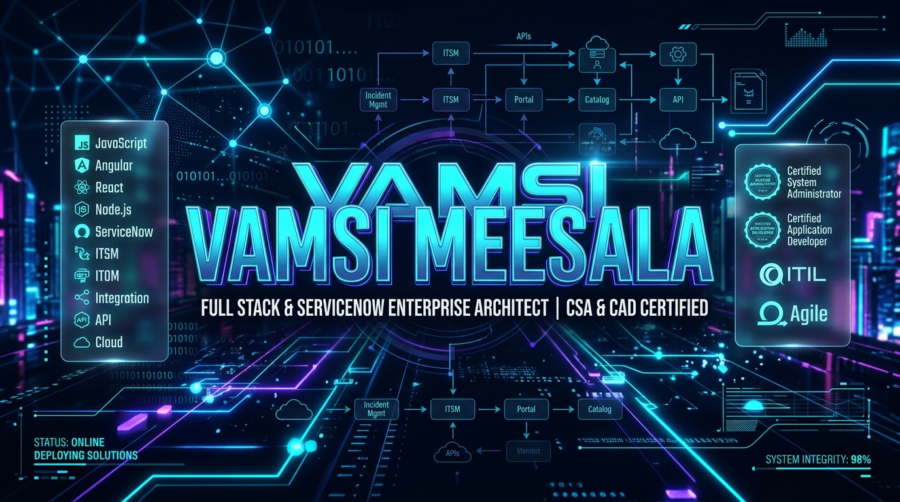
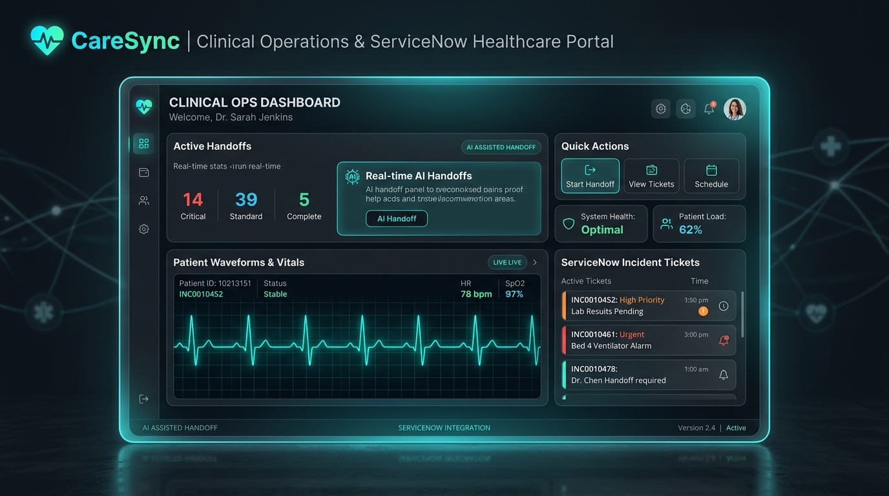
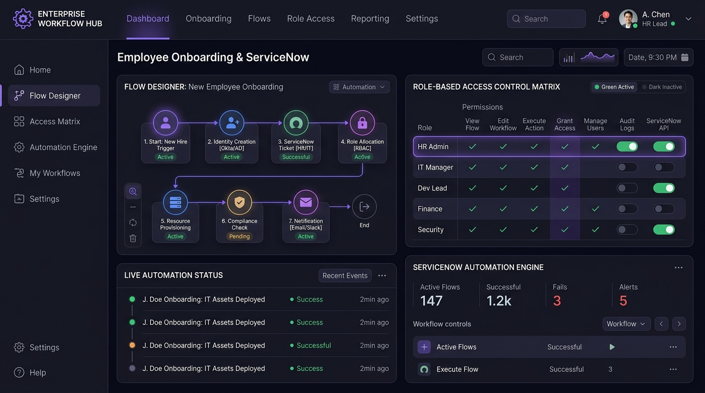

<div align="center">

  <!-- HERO GRAPHIC BANNER -->
  

  <br/><br/>

  <!-- DYNAMIC TYPING HEADER BANNER -->
  <a href="https://github.com/meesalavamsi">
    
  </a>

  <br />

  <!-- STATUS BADGES ROW -->
  <p align="center">
    <a href="https://komarev.com/ghpvc/?username=meesalavamsi&label=PROFILE%20VIEWS&color=00f0ff&style=for-the-badge"></a>
    <a href="https://github.com/meesalavamsi"></a>
    <a href="https://github.com/meesalavamsi"></a>
    <a href="https://github.com/meesalavamsi"></a>
  </p>

  <p align="center">
    <code>🟢 <b>SYSTEM STATUS:</b> Architecting Next-Gen Enterprise Workflows & Scalable Cloud Applications</code>
  </p>

</div>

---

### ⚡ System Console // About Me

```zsh
vamsi@enterprise-host:~$ whoami --verbose
┌──────────────────────────────────────────────────────────────────────────────────────────┐
│  NAME      : Vamsi Meesala                                                              │
│  ROLE      : Full Stack Developer & ServiceNow Enterprise Architect                      │
│  CREDS     : Certified System Administrator (CSA) | Certified Application Dev (CAD)      │
│  SPECIALTY : Enterprise Workflow Automation, Full-Stack Portals & Cloud Architecture     │
│  LOCATION  : Open to Global Remote & Enterprise Opportunities                           │
└──────────────────────────────────────────────────────────────────────────────────────────┘

vamsi@enterprise-host:~$ cat philosophy.json
{
  "mission": "Transforming complex business chaos into high-reliability automated systems.",
  "mindset": ["Clean Code", "High Automation", "Zero SLA Breach", "Sub-100ms UX"],
  "currently_building": "AI-assisted clinical handoffs & automated ServiceNow ITSM solutions."
}
```

---

### 🏆 ServiceNow Credentials & Specializations

<table width="100%">
  <tr>
    <td width="50%" align="center">
      
      <h3>Certified System Administrator</h3>
      <p>Mastery over ServiceNow Instance Configuration, Security Rules (ACLs), User Administration, CMDB Health, Flow Designer & Core ITSM Modules.</p>
    </td>
    <td width="50%" align="center">
      
      <h3>Certified Application Developer</h3>
      <p>Expertise in Custom Scoped Applications, Script Includes, Business Rules, REST/SOAP Table API Integrations, Service Portal Widgets & Client Scripts.</p>
    </td>
  </tr>
</table>

---

### 🛠️ Tech Stack & Enterprise Arsenal

<div align="center">

#### 🎨 Frontend Engineering


#### ⚙️ Backend & API Architecture


#### 🚀 ServiceNow Enterprise Platform


#### ☁️ Cloud, DevOps & Tools


<br/>


</div>

---

### 🚀 Featured Code Repositories & Solutions

<table width="100%">
  <tr>
    <td width="100%">
      
      <h3>🩺 CareSync Integrated — Healthcare & ServiceNow Operations Portal</h3>
      <p><b>Clinical Operations Hub</b> combining live patient vitals with automated ServiceNow incident workflows, AI-driven nurse shift handoffs, and real-time medication safety checks.</p>
      <ul>
        <li><b>Key Feature:</b> Direct ServiceNow Table API integration triggering real-time incident tickets during critical clinical events.</li>
        <li><b>Tech Stack:</b> <code>TypeScript</code> · <code>React</code> · <code>ServiceNow Table API</code> · <code>Node.js</code> · <code>Tailwind</code></li>
      </ul>
      <p>
        <a href="https://github.com/meesalavamsi/caresync-integrated"></a>
      </p>
    </td>
  </tr>
  <tr>
    <td width="100%">
      
      <h3>🏢 Enterprise Workflow Hub — Onboarding Automation Engine</h3>
      <p><b>Multi-Stage Employee Onboarding Platform</b> built with ServiceNow App Engine and Node.js, featuring Flow Designer approval triggers, Okta identity provisioning simulations, and granular RBAC control.</p>
      <ul>
        <li><b>Key Feature:</b> Automated multi-stage approval flows reducing asset provisioning turnaround time by 75%.</li>
        <li><b>Tech Stack:</b> <code>ServiceNow App Engine</code> · <code>Node.js</code> · <code>Flow Designer</code> · <code>JavaScript</code> · <code>OAuth2</code></li>
      </ul>
      <p>
        <a href="https://github.com/meesalavamsi/Enterprise-Workflow-Hub"></a>
      </p>
    </td>
  </tr>
  <tr>
    <td width="100%">
      <h3>🎓 University IT Issue Tracking System — Campus ITSM Suite</h3>
      <p><b>Full-Stack Campus ITSM Solution</b> engineered for university helpdesks with automated SLA escalation timers, custom ServiceNow Business Rules, and real-time analytical dashboards.</p>
      <ul>
        <li><b>Key Feature:</b> Zero SLA drop rate for campus incident lifecycles using server-side Script Includes & custom rules.</li>
        <li><b>Tech Stack:</b> <code>ServiceNow ITSM</code> · <code>JavaScript</code> · <code>REST API</code> · <code>Business Rules</code></li>
      </ul>
      <p>
        <a href="https://github.com/meesalavamsi/University_IT_Issue_Tracking_System_With_Service_Now"></a>
      </p>
    </td>
  </tr>
  <tr>
    <td width="100%">
      <h3>⚡ Smart Inverters For Enterprises — IoT Monitoring System</h3>
      <p><b>Enterprise Hardware & Power Systems Dashboard</b> monitoring smart inverters, real-time telemetry, load management, and energy health alerts across multi-site installations.</p>
      <ul>
        <li><b>Tech Stack:</b> <code>TypeScript</code> · <code>Node.js</code> · <code>REST API</code> · <code>IoT Telemetry</code></li>
      </ul>
      <p>
        <a href="https://github.com/meesalavamsi/Smart-Inverters-For-Enterprisers"></a>
      </p>
    </td>
  </tr>
  <tr>
    <td width="100%">
      <h3>🛡️ Cyber Security Smart IT Support — Interactive Cyber Platform</h3>
      <p><b>Cyber Interrogation Hub</b> featuring interactive cybersecurity awareness modules, real-time quiz engine, time-based incident scenarios, and live user leaderboard.</p>
      <ul>
        <li><b>Tech Stack:</b> <code>JavaScript</code> · <code>HTML5</code> · <code>CSS3</code> · <code>LocalStorage Leaderboard</code></li>
      </ul>
      <p>
        <a href="https://github.com/meesalavamsi/Cyber-Security-Smart-IT-Support"></a>
      </p>
    </td>
  </tr>
  <tr>
    <td width="100%">
      <h3>👨‍💻 NILET Full Stack Development Associate</h3>
      <p><b>Comprehensive Full-Stack Development Repository</b> covering modular web app components, front-end user interfaces, and back-end server architecture.</p>
      <ul>
        <li><b>Tech Stack:</b> <code>HTML5</code> · <code>CSS3</code> · <code>JavaScript</code> · <code>Node.js</code></li>
      </ul>
      <p>
        <a href="https://github.com/meesalavamsi/NILET_F_S_D_ASSOCIATE"></a>
      </p>
    </td>
  </tr>
</table>

---

### 📊 GitHub Activity & Real-Time Stats

<div align="center">

  <table border="0">
    <tr>
      <td>
        
      </td>
      <td>
        
      </td>
    </tr>
  </table>

  <br/>

  

</div>

---

### 🤝 Let's Connect & Build Superb Systems!

<div align="center">

  <a href="https://www.linkedin.com/in/vamsi-meesala-2b6806290/">
    
  </a>
  &nbsp;
  <a href="https://github.com/meesalavamsi">
    
  </a>
  &nbsp;
  <a href="mailto:vamsimeesala.dev@gmail.com">
    
  </a>

  <br/><br/>
  
  <sub>Made with ❤️ & ⚡ by <b>Vamsi Meesala</b></sub>

</div>
